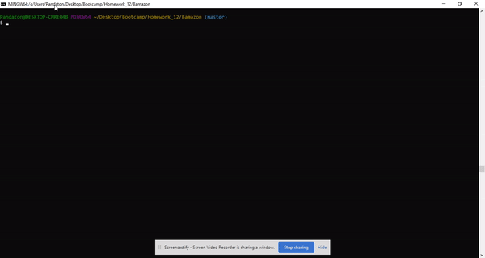

# Bamazon
This is a simple command line application of an Amazon-like store front using Node.js and MySQL. This exercise is for the customer interface, this app let the user choise a product from the table of the store, select the item by ID and bring to the program the quantity would purchase, the code compare if have enougth stock of that product, in afirmative case show the total cost, but if the stock is insufficient displayed the message to the user and display the table of products again.

## Getting Started
In order to run this application you should have the MySQL database installed and ready on your machine. If you have set up correctly on your computer MySQL, follow the next steps:
- Clone the repo
- Open the Terminal or Git Bash to install the npm packages neededs, in order to do this run the follow command:
    - 'npm i mysql'
    - 'npm i inquirer'
    - 'npm i cli-table'
    - 'npm i figlet'
- Run the program with the command 'node bamazonCustomer.js'

## Running the test
It looks like this in action

## Technologies used
- Node.js
- Inquire NPM Package
- MySQL NPM Package
- CLI Table NPM Package
- Figlet NPM Package

